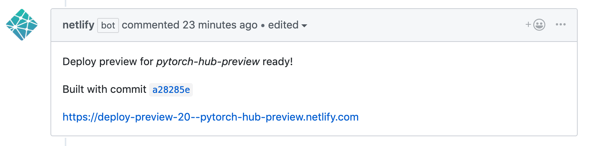

# PyTorch Hub

[](https://circleci.com/gh/pytorch/hub)

## Logistics


We accept submission to PyTorch hub through PR in `hub` repo. Once the PR is merged into master here, it will show up on [PyTorch website](https://pytorch.org/hub) in 24 hrs.


## Steps to submit to PyTorch hub

1. Add a `hubconf.py` in your repo, following the instruction in [torch.hub doc](https://pytorch.org/docs/master/hub.html#publishing-models). Verify it's working correctly by running `torch.hub.load(...)` locally.
2. Create a PR in `pytorch/hub` repo. For each new model you have, create a `<repo_owner>_<repo_name>_<title>.md` file using this [template](docs/template.md).

### Notes
- Currently we don't support hosting pretrained weights, users with pretrained weights need to host them properly themselves.
- In general we recommend one model per markdown file, models with similar structures like `resnet18, resnet50` should be placed in the same file.
- If you have images, place them in `images/` folder and link them correctly in the `[images/featured_image_1/featured_image_2]` fields above.
- We only support a pre-defined set of tags, currently they are listed in [scripts/tags.py](scripts/tags.py). We accept PRs to expand this set as needed.
- To test your PR locally, run the tests below.
```
python scripts/sanity_check.py
./scripts/run_pytorch.sh
```
- Our CI concatenates all python code blocks in one markdown file and runs it agaist the latest PyTorch release.
  - Remember to mark your python code using ```` ```python```` in model markdown file.
  - If your `dependencies` is not installed on our CI machine, add them in [install.sh](scripts/install.sh).
  - If it fails, you can find a new `temp.py` file left in the repo to reproduce the failure.
- We also provide a way to preview your model webpage through `netlify bot`. This bot builds your PR with latest `pytorch.github.io` repo and comment on your PR with preview link. The preview will be updated as you push more commits to the PR.


