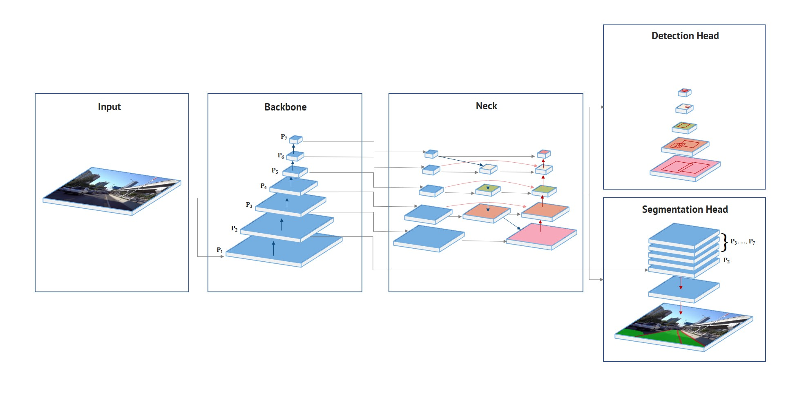

## Before You Start

Start from a **Python>=3.8** environment with **PyTorch>=1.10** installed. To install PyTorch see [https://pytorch.org/get-started/locally/](https://pytorch.org/get-started/locally/). To install HybridNets dependencies:
```bash
pip install -qr https://raw.githubusercontent.com/datvuthanh/HybridNets/main/requirements.txt  # install dependencies
```

## Model Description

<div align="center">
 
  
**HybridNets Network Architecture.**  
 
</div>

HybridNets is an end2end perception network for multi-tasks. Our work focused on traffic object detection, drivable area segmentation and lane detection.  HybridNets can run real-time on embedded systems, and obtains SOTA Object Detection, Lane Detection on BDD100K Dataset.

### Results

### Traffic Object Detection
 
<table>
<tr><th>Result </th><th>Visualization</th></tr>
<tr><td>

|        Model       |  Recall (%)  |   mAP@0.5 (%)   |
|:------------------:|:------------:|:---------------:|
|     `MultiNet`     |     81.3     |       60.2      |
|      `DLT-Net`     |     89.4     |       68.4      |
|   `Faster R-CNN`   |     77.2     |       55.6      |
|      `YOLOv5s`     |     86.8     |       77.2      |
|       `YOLOP`      |     89.2     |       76.5      |
|  **`HybridNets`**  |   **92.8**   |     **77.3**    |

</td><td>


</td></tr> </table>
 
### Drivable Area Segmentation
 
<table>
<tr><th>Result </th><th>Visualization</th></tr>
<tr><td>

|       Model      | Drivable mIoU (%) |
|:----------------:|:-----------------:|
|    `MultiNet`    |        71.6       |
|     `DLT-Net`    |        71.3       |
|     `PSPNet`     |        89.6       |
|      `YOLOP`     |        91.5       |
| **`HybridNets`** |      **90.5**     |

</td><td>


</td></tr> </table>
 
### Lane Line Detection
 
<table>
<tr><th>Result </th><th>Visualization</th></tr>
<tr><td>

|      Model       | Accuracy (%) | Lane Line IoU (%) |
|:----------------:|:------------:|:-----------------:|
|      `Enet`      |     34.12    |       14.64       |
|      `SCNN`      |     35.79    |       15.84       |
|    `Enet-SAD`    |     36.56    |       16.02       |
|      `YOLOP`     |     70.5     |        26.2       |
| **`HybridNets`** |   **85.4**   |      **31.6**     |

</td><td>


</td></tr> </table>

 
<div align="center">
 
 
 
 [Original footage](https://www.youtube.com/watch?v=lx4yA1LEi9c) courtesy of [Hanoi Life](https://www.youtube.com/channel/UChT1Cpf_URepCpsdIqjsDHQ)
 
 </div>
 
### Load From PyTorch Hub
This example loads the pretrained **HybridNets** model and passes an image for inference.
```python
import torch

# load model
model = torch.hub.load('datvuthanh/hybridnets', 'hybridnets', pretrained=True)

#inference
img = torch.randn(1,3,640,384)
features, regression, classification, anchors, segmentation = model(img)
```

### Citation

If you find our [paper](https://arxiv.org/abs/2203.09035) and [code](https://github.com/datvuthanh/HybridNets) useful for your research, please consider giving a star :star:   and citation :pencil: :

```BibTeX
@misc{vu2022hybridnets,
      title={HybridNets: End-to-End Perception Network}, 
      author={Dat Vu and Bao Ngo and Hung Phan},
      year={2022},
      eprint={2203.09035},
      archivePrefix={arXiv},
      primaryClass={cs.CV}
}
```

